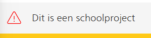

# BrowserTech Sprint 1 

### Daily check out 16/02/2026
Wat heb ik vandaag gedaan? 
ik heb vandaag een begin gemaakt aan mijn html opdracht waarbij ik formulieren moet maken. Ik heb de eerste pagina helemaal gestructureerd met HTML, en ik heb de artikel gelezen voor de weekly geek. Daarnaast heb ik deelgenomen aan de kickoff/workshop waarbij er meer werd verteld over formulieren en hoe we ermee moeten werken en wat belangrijk is en wat niet. Dit kreeg ik van Vasilis en Victor.

Hoeveel tijd heeft me dat gekost? Het heeft me ongveer 2 uren gekost voor de kickoff, en voor mijn website zelf ongeveer 3-4 uurtjes. Uiteindelijk, voor het lezen van de artikel een uurtje.

Wat heb ik geleerd? ik heb geleerd hoe ik kan werken met formulieren, en hoe ik die moet maken. Waar ik op moet letten. Dus hoe ik me content kan plaatsen in fieldset etc. Dus soort van nesten. Ook heb ik geleerd hoe belangrijk de input fields zijn, vooral voor gebruikers met een telefoon. Hierdoor kunnen mensen makkelijker hun taken voltooien en andere dingen doen.

Wat ga ik morgen doen? Morgen ga ik me website een stijl geven en werken met css aan de formulier. Dit ga ik doen a.d.h.v. de NS huisstijl.

bronnen;
- https://tonsky.me/blog/tahoe-icons/

### Daily check out 17/02/2026
Wat heb ik vandaag gedaan? 
ik heb vandaag mijn website stijl gegeven. Ik heb de kleuren opgezocht op de NS website en daarna die toegepast in mijn code. Vervolgens heb ik de workshop gevolgd om meer te weten over HTML. En ben ik voor de rest van de dag aan mijn website gaan zitten.

Hoeveel tijd heeft me dat gekost? Het heeft me ongveer 1.3 u gekost voor de workshop, en voor mijn eigen werk 3.

Wat heb ik geleerd? ik heb geleerd hoe ik beter kan werken met MDN, dus hoe ik bepaalde dingen kan zoeken voor het coderen. En een paar inputs die ik kan gebruiken.

Wat ga ik morgen doen? Morgen ga ik me website's stijl af proberen te maken van de eerste pagina.

bronnen;

### weekly Geek
Tijdens deze weekly geek heb ik me bezig gehouden met iconen die apple gebruikt. Wat me interreseert is dat hij voorbeelden geeft en die uitlegt. Ook neemt hij de regels erbij die apple zelf zei en schrijft hoe zij zich niet daaraan houden. Ik ben een kant met hem eens dat er te veel iconen worden gebruikt voor teveel verschillende dingen. En dat de zeer weinige iconen maar nuttige beter zijn dan heel veel iconen voor alles. Door iconen te zetten voor de belamgrijke dingen, kan de gebruiker makkelijker dingen vinden waarnaar zij zoeken.

## Weekly checkout week 1 (16 – 17 februari 2026)

**Wat heb ik deze week gedaan?**
ik heb deze week de kickoff gevolgd over formulieren en ben begonnen aan mijn html opdracht. daarna heb ik de NS huisstijl opgezocht en toegepast op mijn website via css. ook heb ik de weekly geek artikel gelezen en de workshops gevolgd van Vasilis en Victor.

**Hoeveel tijd heeft me dat gekost?**
het heeft me ongeveer 11 uur gekost. 2 uur voor de kickoff, 3-4 uur aan mijn website, 1 uur voor het artikel en 1.5 uur voor de workshop.

**Wat heb ik geleerd?**
ik heb geleerd hoe ik kan werken met formulieren in html, hoe ik die moet structureren met fieldset en hoe ik dingen kan nesten. ook heb ik geleerd hoe belangrijk de input fields zijn voor gebruikers met een telefoon. daarnaast heb ik MDN beter leren gebruiken.

**bronnen**
- https://tonsky.me/blog/tahoe-icons/


### Daily check out 2/03/2026
Wat heb ik vandaag gedaan? 
ik heb vandaag mijn website aangepast, ik heb progressive disclosure toegevoegd, en ik heb de workshop gevolg over validefren. 

Hoeveel tijd heeft me dat gekost? Het heeft me ongveer 1.3 u gekost voor de workshop, en voor mijn eigen werk 3.

Wat heb ik geleerd? ik heb geleerd hoe ik me website's html css kan valideren en hoe ik progressive disclosure kan laten werken met css alleen ipv javascript

Wat ga ik morgen doen? Morgen ga ik me website's afmaken qua progressive disclosure en stijl, en als ik genoeg tijd heb . ga ik de ander pettern in doen.

bronnen;

### Daily check out 3/03/2026
Wat heb ik vandaag gedaan? 
ik heb vandaag de weekly geek voorbereid tijdens de les. Daarna heb ik me progressive disclosure afgemaakt voor de eerste pettern. Ik heb ook een begin gemaakt aan mijn navigatie.

Hoeveel tijd heeft me dat gekost? Het heeft me ongveer 1.3 u gekost voor de weekly geek, en voor mijn eigen werk 3.

Wat heb ik geleerd? ik heb geleerd hoe ik de progressive disclosure kan laten werken voor de parents en dan ook de childeren daarin.

Wat ga ik morgen doen? Morgen ga ik aan de slag met css to the rescue.

bronnen; https://tractie.ns.nl/2e23992f3/p/088193-iconography/b/02fb99

### weekly Geek

tijdens deze weekly geek heb ik geleerd hoe ik een checkbox en radiobutton kan laten werken dmv div en span.

wat je namelijk nodig heb is de;

``` html

<span
  role="checkbox"
  aria-checked="false"
  tabindex="0"
  aria-labelledby="chk1-label"></span>
<label id="chk1-label">Remember my preferences</label> 

```
De role zorgt ervoor dat de screenreader het ziet als een checkbox,
aria-checked="true/false" geeft aan of hij geselecteerd is.
tabindex="0" op de geselecteerde optie (die krijgt focus)
Tekst binnen de div werkt als label; of je koppelt met aria-labelledby.

## Weekly checkout week 2 (2 – 3 maart 2026)

**Wat heb ik deze week gedaan?**
ik heb deze week progressive disclosure toegevoegd aan mijn website en de workshop gevolgd over valideren. daarna heb ik de weekly geek voorbereid en gepresenteerd, en ben ik begonnen met mijn navigatie. ook heb ik een begin gemaakt aan css to the rescue.

**Hoeveel tijd heeft me dat gekost?**
het heeft me ongeveer 13 uur gekost. 2x 1.5 uur voor de workshops en weekly geek, de rest aan mijn eigen website.

**Wat heb ik geleerd?**
ik heb geleerd hoe ik progressive disclosure kan laten werken met alleen css zonder javascript, en hoe ik dat kan toepassen op de parents en children. ook heb ik geleerd hoe ik mijn html en css kan valideren.

**bronnen**
- https://tractie.ns.nl/2e23992f3/p/088193-iconography/b/02fb99

### Daily check out 9/03/2026
Wat heb ik vandaag gedaan? 
ik heb vandaag mijn validatie afgemaakt binnen html en css, voor nu laat ik het daarbij, als ik meer tijd heb ga ik van javascript erbij doen. daarnaast heb ik de navigatie afgemaakt en detext daarpnder die zegt dat het een school project is met de stijl van de NS.


Daarna heb ik de knop gefixed waarbij iemand een pdf kan uploaden.

Hoeveel tijd heeft me dat gekost? Het heeft me ongveer 4 uren gekost.

Wat heb ik geleerd? ik heb geleerd hoe ik de validatie beter kan doen waarbij er alleen letters moeten worden gebruikt etc. BV;

``` HTML

<input type="text" id="voorLetters" required pattern="[A-Za-z.]+" title="Vul alleen letters en punten in">

```

Wat ga ik morgen doen? Morgen ga ik beginnen aan de tweede pattern, en me website responsive maken.

bronnen; 
- https://developer.mozilla.org/en-US/docs/Web/CSS/Reference/Selectors/:user-valid
- https://developer.mozilla.org/en-US/docs/Web/CSS/Reference/Selectors/:user-invalid
- https://www.w3schools.com/tags/att_input_pattern.asp

### Daily check out 10/03/2026
Wat heb ik vandaag gedaan? 
ik heb vandaag weer naar mijn validatie gekeken, want ik wou het ook laten werken in javascript. Ik heb de template gevolgd van de workshop maar ik kwam daar niet uit. Ik was wel heel lang mee bezig maar geen succes. Dus ik heb gekozen om het even te laten liggen. Hierna ben ik aan de slag gegaan met de tweede pattern. Ik heb gekozen voor de pagina 4 van het formulier. Dit heb ik gekozen zoda ik een vergijer kan toevoegen met een knop 'voeg nog een verkrijger toe'. Ik heb de html en css al begin aan gemaakt en moet alleen de javascfript laten werken met templaten. Ook heb ik gewerkt aan het responsive maken van de website.

Hoeveel tijd heeft me dat gekost? Het heeft me ongveer 4-5 uren gekost.

Wat heb ik geleerd? ik heb niet iets nieuws geleerd

Wat ga ik morgen doen? Morgen ga ik CSS doen

### weekly Geek

Tijdens deze weekly geek keek ik naar de video. Ik vond de styling een beetje teveel gepushed. Maar het boodschap kon ik wel snappen. Namelijk text inputs, en dat zij niet geforceerd of veranderd hoeven te worden als dat niet moet. Want wat hij zegt is dat de input zo goed is en dat het veranderd in een border die je kan klikken.

## Weekly checkout week 3 (9 – 10 maart 2026)

**Wat heb ik deze week gedaan?**
ik heb deze week mijn validatie afgemaakt binnen html en css en de navigatie en voettekst afgemaakt. ook heb ik de knop gefixed waarbij iemand een pdf kan uploaden. daarna heb ik geprobeerd javascript validatie toe te voegen via de workshop template maar dat is niet gelukt. vervolgens ben ik begonnen aan de tweede pattern waarbij ik pagina 4 van het formulier heb gekozen, en heb ik de website responsive gemaakt.

**Hoeveel tijd heeft me dat gekost?**
het heeft me ongeveer 9 uur gekost, 4-5 uur per dag.

**Wat heb ik geleerd?**
ik heb geleerd hoe ik de validatie beter kan doen waarbij er alleen letters moeten worden gebruikt via het pattern attribuut, en hoe ik :user-valid en :user-invalid kan gebruiken in css. ook heb ik geleerd dat javascript validatie meer tijd kost dan verwacht.

**bronnen**
- https://developer.mozilla.org/en-US/docs/Web/CSS/Reference/Selectors/:user-valid
- https://developer.mozilla.org/en-US/docs/Web/CSS/Reference/Selectors/:user-invalid
- https://www.w3schools.com/tags/att_input_pattern.asp

### Daily check out 16/03/2026
Wat heb ik vandaag gedaan? 
ik heb vandaag me website beter responisve gemaakt. Ook heb ik wat javascript toegevoegd, waarbij de scherm automatisch scrolled als je een radio button selecteerd, en met cloning heb ik gewerkt, waarbij er een stukje form erbij komt als de gebruiker klikt op 'verkrijger toevoegen'

Ik probeerde dit eerst met innerhtml veranderen, maar dan verandere me hele html dus ik ging opzoek naar een andere manier. Ik deed eerst dit;

``` JS

let templating2A = document.querySelector(".verkijgerToevoegenKnop");
let formulier = document.querySelector("form");
templating2A.addEventListener("click", toonVolgendeTemplate);

function toonVolgendeTemplate() {
    formulier.insertAdjacentHTML("beforeend", ` 
                <div class="divVan2a">
                <fieldset class="_2a-1">
                    <legend class="legend2a">2a</legend>

                    <h2>Zijn er verkrijgers voor wie u geen aangifte doet?</h2>
                    <label>
                            Nee
                            <input type="radio" name="verkijgers" value="nee" required />
                        </label>

                        <label>
                            Ja. Vul hieronder de gegevens in van de verkrijgers waarvoor u geen aangifte doet. Gaat het om een instelling? Vul dan de naam van deinstelling in bij 'achternaam'. Het invullen van een bsn is niet verplicht, maar wel handig voor ons.
                            <input type="radio" name="verkijgers"  value="ja" required />
                        </label>
                </fieldset>

                <fieldset class="_2a-2">
                    <legend>Gegevens verkrijger 1</legend>

                    <label for="bsnVerkrijger1">BSN/RSIN</label>
                    <input type="number" id="bsnVerkrijger1" minlength="9" maxlength="9" size="9">

                    <label for="voorLettersVerkrijger1">Voorletter(s)</label>
                    <input type="text" id="voorLettersVerkrijger1" pattern="[A-Za-z.]+" title="Vul alleen letters en punten in">

                    <label for="tussenVoegselsVerkrijger1">Tussenvoegsel(s)</label>
                    <input type="text" id="tussenVoegselsVerkrijger1" pattern="[a-zA-Z ]+" title="Vul alleen letters in">

                    <label for="achterNaamVerkrijger1">Achternaam</label>
                    <input type="text" id="achterNaamVerkrijger1" pattern="[a-zA-Z\s\-]+" title="Vul alleen letters in">

                    <fieldset class="_2a-2-1">
                        <legend>Krijgt deze verkrijger waarvoor u geen aangifte doet het hele vermogen?</legend>

                        <label>
                            Nee.
                            <input type="radio" name="verkrijgerVermogen" value="nee" required />
                        </label>

                        <label>
                            Ja
                            <input type="radio" name="verkrijgerVermogen" value="ja" required />
                        </label>
                    </fieldset>

                    <fieldset class="_2a-2-2">
                        <legend>Doet deze verkrijger een beroep op diens legitieme portie (wettelijke erfdeel)?</legend>

                        <label>
                            Nee.
                            <input type="radio" name="legitiemePortie" value="nee" required />
                        </label>

                        <label>
                            Ja
                            <input type="radio" name="legitiemePortie" value="ja" required />
                        </label>
                    </fieldset>

                </fieldset>

                <button class="verkijgerToevoegenKnop" type="button">Voeg nog een verkrijger toe</button>


            </div>
    `);
}

```

Dit werkte namelijk niet en ben ik online gaan zoeken hoe het beter kon en kwam op dit neer;

``` javascript

// bron info https://www.w3schools.com/tags/tag_template.asp
let templating2A = document.querySelector(".verkijgerToevoegenKnop");
let template = document.getElementById("verkrijgerTemplate");
let div2A = document.querySelector(".divVan2a")
templating2A.addEventListener("click", volgendeVerkrijger);


function volgendeVerkrijger() {
    const kloon = template.content.cloneNode(true);
    const aantalVerkijrgers = div2A.querySelectorAll(".divVan2a").length + 2;
    kloon.querySelector(".legend2a").textContent = `Over verkrijger ${aantalVerkijrgers}`;
    kloon.querySelector(".legend2a-2").textContent = `Gegevens verkrijger ${aantalVerkijrgers}`;

    div2A.insertBefore(kloon, templating2A);
}

```

Daarna ben ik gaan zitten aan de kleine details te fixen, zoals de breedte en me code beetje opschonen waar ik dingen heb disabled.


Hoeveel tijd heeft me dat gekost? Het heeft me ongveer 4-5 uren gekost.

Wat heb ik geleerd? ik heb geleerd hoe ik met javascript een stukje html kan klonen, met template in html te zetten en met javascript die te laten wijzen. dit is de code die eigenlijk het mogelijk maakt; 
``` javascript 
const kloon = template.content.cloneNode(true); 

```

Wat ga ik morgen doen? Morgen ga ik me code beter opschonen en me code goede volgorde geven en me laatste loodjes binnen me website afmaken. en me radiobuttons naast elkaar zetten, door de styling op het element zelf te zetten waar er display blok staat.

### Daily check out 17/03/2026
Wat heb ik vandaag gedaan? 
ik heb vandaag mijn website beter gemaakt qua accesibility, want ik had geen aria lable by gebruikt. welke heel goed is voor mensen die screenreaders gebruiken. daarnaast heb ik gekeken naarde code, om mijn error message aan de onderkant te laten verschijnen als iemand de veld niet goed heeft ingevuld etc. 

Hoeveel tijd heeft me dat gekost? Het heeft me ongveer 4-5 uren gekost.

Wat heb ik geleerd? ik heb geleerd dat die aria lable by heel belangrijk us voor mensen die een screen reader gebruiken. Ook hoe ik de text in me website kan zetten en die tevoorschijn kan laten komen met display block en none, en dan de styling erop.

Wat ga ik morgen doen? Morgen ga ik CSS doen.

## Weekly checkout week 4 (16 – 17 maart 2026)

**Wat heb ik deze week gedaan?**
ik heb deze week mijn website beter responsive gemaakt en javascript toegevoegd waarbij het scherm automatisch scrolled als je een radio button selecteerd. ook heb ik gewerkt met cloning waarbij er een stukje form erbij komt als de gebruiker klikt op verkrijger toevoegen. daarna heb ik mijn accessibility verbeterd door aria-labelledby toe te voegen en heb ik foutmeldingen laten verschijnen via css met display block en none.

**Hoeveel tijd heeft me dat gekost?**
het heeft me ongeveer 9 uur gekost, 4-5 uur per dag.

**Wat heb ik geleerd?**
ik heb geleerd hoe ik met javascript een stukje html kan klonen via template.content.cloneNode(true) en die dynamisch in de DOM kan plaatsen. ook heb ik geleerd hoe belangrijk aria-labelledby is voor mensen die een screenreader gebruiken.

**bronnen**
- https://www.w3schools.com/tags/tag_template.asp

# Reflectie

**over het proces**

Wat heel goed ging is dat ik makkelijk de nieuwe code kon snappen over de fieldset en labels en inputs, alleen in het begin moest ik de hierachie wel goed onder de knie krijgen maar dat ging snel. Ik vind dat dit goed ging want ik had niet veel tijd nodig om het toe te passen.

Wat minder goed ging is het gebruik maken van javascript en die validatie erin doen. het werd alleen toegepast op de eerste input toen ik het probeerde. Dus ik heb dan een alternatief gebruikt met display block en display none op een ```<p>```.

Wat ik anders zou doen volgende keer is meer tijd besteden om javascript beter te leren.

Waarmee ik meer vast zat was de progressive disclosure laten werken met css. Dit had ik opgelast met display block en none met de code;

``` css

.divVan1b {
    &:has(input[name="1bEersteVraag"][value="nee"]:checked) + .divVan1c ._1c-1,
    &:has(input[name="1bTweedeVraag"][value="nee"]:checked) + .divVan1c ._1c-1,
    &:has(input[name="1bDerdeVraag"][value="nee"]:checked) + .divVan1c ._1c-1,
    &:has(input[name="1bDerdeVraag"][value="ja"]:checked) + .divVan1c,
    &:has(input[name="1bDerdeVraag"][value="ja"]:checked) + .divVan1c ._1c-1 {
        display: block;
    }
}

```


**over me leerdoelen**

Ik wilde aan het begin meer leren werken met javascript, en ik vind dat ik het niet goed genoeg heb gehaald want ik heb weinig gedaan met javascript. Wat me het meest heeft verras is dat HTML veel meer dingen heeft dan ik dacht en dat ik het heb kunnen leren en toepassen.


**over me code**

Ik ben het meest trots op het algemene styling binnen me website, daarnaast op die progressive disclosure die ik heb laten werken met css, want ik zat heel lang daarmee te knoeien. 
Wat ik nog niet goed genoeg vind is dat de knoppen niet naast elkaar zijn als het op groter scherm word getoont, en de javascript code die zeer nau is.


**Eind resultaat**
